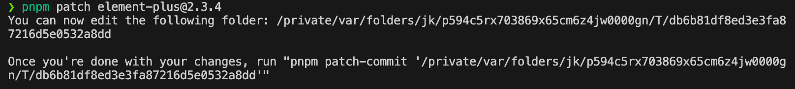

---
# 这是文章的标题
# title: Git 指南
# 你可以自定义封面图片
# cover: /assets/images/cover1.jpg
# 这是页面的图标
# icon: fa-brands fa-git-alt
# 这是侧边栏的顺序
# order: 3
date: 2024-1-21
category:
  - Node
tag:
  - Node
  - pnpm
# # 此页面会在文章列表置顶
# sticky: true
# # 此页面会出现在文章收藏中
star: true
# # 你可以自定义页脚
# footer: 这是测试显示的页脚
# # 你可以自定义版权信息
# copyright: 无版权
---

# pnpm patch 修补第三方依赖

我们开发过程中常常会遇到第三方依赖有 bug 的情况，这时我们可以使用 pnpm patch 来打补丁修复。

## pnpm patch

比如，在使用 element plus 时，发现了一个 bug。首先我们需要知道正在使用的 element plus 版本，这里以 2.3.4 为例, 然后使用如下命令

```shell
pnpm patch element-plus@2.3.4
```

这时会出现一个临时目录，该目录可以通过 `--edit-dir` 来指定。



## pnpm patch-commit

然后可以在这个目录下进行修改，修改完成后使用 `pnpm patch-commit xxx` 来提交修改内容， `xxx` 为`pnpm patch`命令生成的临时目录。

```shell
pnpm patch-commit '/private/var/folders/jk/p594c5rx703869x65cm6z4jw0000gn/T/db6b81df8ed3e3fa87216d5e0532a8dd'
```

之后会在项目根目录下生成一个patches文件夹，里面是生成的patch文件。


同时会在`package.json`中添加一条记录

```json
  "pnpm": {
    "patchedDependencies": {
      "element-plus@2.3.4": "patches/element-plus@2.3.4.patch"
    }
  }
```

## pnpm patch-remove

如果作者修复了这个bug, 可以使用 `pnpm patch-remove` 来撤销修补。

> pnpm patch-remove 需要 pnpm 版本 >= 8.5.0.

```shell
pnpm patch-remove element-plus@2.3.4
```

这时会删除patches文件夹下对应的patch文件和`package.json`中对应的记录。

## npm&yarn

- npm 可以使用 `patch-package` 包
- yarn 可以使用 `yarn patch` 命令