# 蛇形布局

实现的效果如下图所示

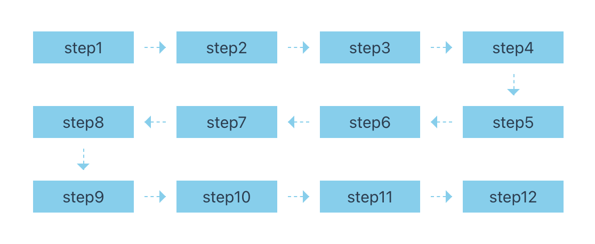

[查看源码](#源码)

## 使用 flex 完成 m\*n 的布局

首先使用 flex 完成一个简单的 m\*n 布局

```vue
<template>
  <div class="container">
    <div class="item" v-for="(item, index) in list" :key="index">
      step{{ index + 1 }}
    </div>
  </div>
</template>

<script setup lang="ts">
import { ref } from "vue";

const list = ref(new Array(12).fill(""));
</script>

<style lang="scss" scoped>
$colNum: 4; // 列数
$rowDistance: 40px; // 行间距
$colDistance: 30px; // 列间距

.container {
  display: flex;
  flex-wrap: wrap;
  gap: $rowDistance $colDistance;

  .item {
    width: calc((100% - $colDistance * ($colNum - 1)) / $colNum);
    height: 30px;
    display: flex;
    align-items: center;
    justify-content: center;
    background-color: skyblue;
  }
}
</style>
```

实现的效果如下

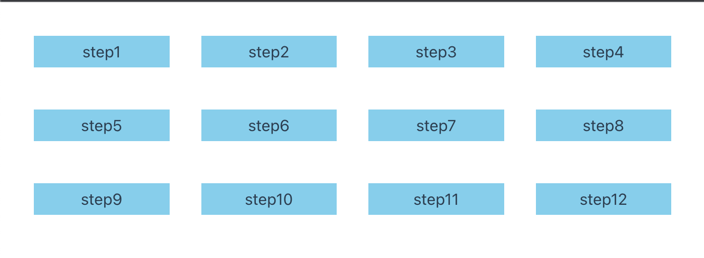

## 调整偶数行顺序

对比我们想要的效果发现第二行的顺序是反的，5678 应改为 8765。

```text
1  2  3  4       1  2  3  4
5  6  7  8   ->  8  7  6  5
9  10 11 12      9  10 11 12
```

在 flex 中，可以通过 order 来控制元素的排列顺序，order 的值越小，排列越靠前，默认为 0。

首先需要设置一个变量`--index`，值使用当前元素的下标。

```vue
<template>
  <div class="container">
    <div
      class="item"
      v-for="(item, index) in list"
      :key="index"
      :style="{ '--index': index + 1 }"
    >
      step{{ index + 1 }}
    </div>
  </div>
</template>
```

然后使用`--index`来初始化每个元素的 order 属性，这时元素顺序并没有改变。

```scss
.container {
  .item {
    order: var(--index);
  }
}
```

现在，我们只需要修改偶数行的 order 值就能改变元素的顺序，以每行 4 列为例，偶数行就是 8n+5, 8n+6, 8n+7, 8n+8。所以每行 colNum 个时，偶数行就是`(2*colNum)n + colNum +1`,`(2*colNum)n + colNum +2`,`(2*colNum)n + colNum +3`,`(2*colNum)n + colNum +4`

```scss
$colNum: 4; // 列数

.container {
  .item {
    order: var(--index);

    @for $i from 1 through $colNum {
      &:nth-child(#{2 * $colNum}n + #{$colNum + $i}) {
        // 修改偶数行的order值
        // order: ???
      }
    }
  }
}
```

最后我们只需要确定偶数行的 order 值就可以了。还是以每行 4 个为例，5678 的 order 值分别要+3，+1，-1，-3，如下图所示。

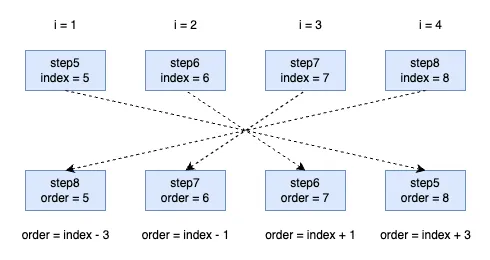

每行 5 个时，678910 的 order 值分别要+4，+2，0, -2，-4，如下图所示。

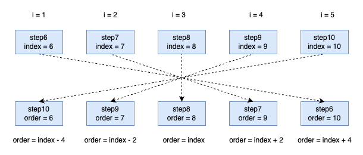

当推广到每行 colNum 个时，我们需要将 order, colNum, index, i 这几个变量关联起来，如下表所示，不难看出`order = index + colNum - 2 * i + 1`。

| colNum |  i  | index | order |            -            |
| :----: | :-: | :---: | :---: | :---------------------: |
|   4    |  1  |   5   |   8   | 8 = 5 + 4 - 2 \* 1 + 1  |
|   4    |  2  |   6   |   7   | 7 = 6 + 4 - 2 \* 2 + 1  |
|   4    |  3  |   7   |   6   | 6 = 7 + 4 - 2 \* 3 + 1  |
|   4    |  4  |   8   |   5   | 5 = 8 + 4 - 2 \* 4 + 1  |
|   5    |  1  |   6   |  10   | 10 = 6 + 5 - 2 \* 1 + 1 |
|   5    |  2  |   7   |   9   | 9 = 7 + 5 - 2 \* 2 + 1  |
|   5    |  3  |   8   |   8   | 8 = 8 + 5 - 2 \* 3 + 1  |
|   5    |  4  |   9   |   7   | 7 = 9 + 5 - 2 \* 4 + 1  |
|   5    |  5  |  10   |   6   | 6 = 10 + 5 - 2 \* 5 + 1 |

代码如下：

```scss
$colNum: 4; // 列数

.container {
  .item {
    order: var(--index);

    @for $i from 1 through $colNum {
      &:nth-child(#{2 * $colNum}n + #{$colNum + $i}) {
        // 修改偶数行的order值
        order: calc(var(--index) + $colNum - 2 * $i + 1);
      }
    }
  }
}
```

效果如下：

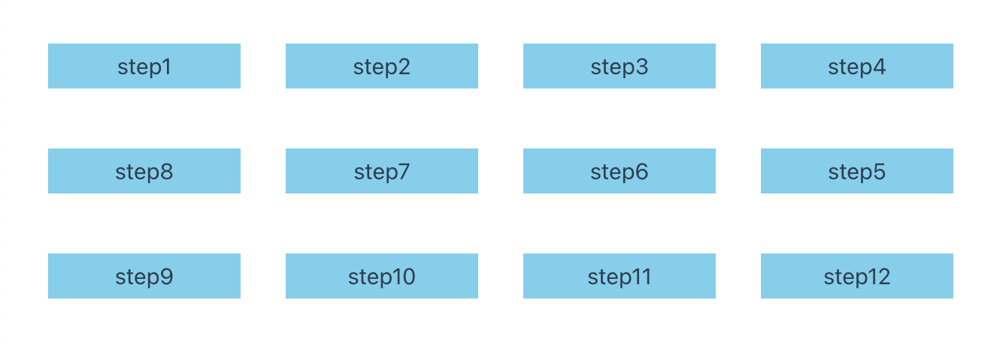

## 添加箭头

### item 间添加箭头

最后我们需要在元素之间添加箭头，这里我采用伪元素来实现。

首先为 item 添加相对定位，然后为 item 添加 before，after 伪元素，使用绝对定位确定箭头的位置。

```scss {19,27-43}
$colNum: 4; // 列数
$rowDistance: 40px; // 行间距
$colDistance: 40px; // 列间距
$lineWidth: 20px; // 步骤间连线长度

.container {
  display: flex;
  flex-wrap: wrap;
  gap: $rowDistance $colDistance;

  .item {
    width: calc((100% - $colDistance * ($colNum - 1)) / $colNum);
    height: 30px;
    display: flex;
    align-items: center;
    justify-content: center;
    background-color: skyblue;
    order: var(--index);
    position: relative;

    @for $i from 1 through $colNum {
      &:nth-child(#{2 * $colNum}n + #{$colNum + $i}) {
        order: calc(var(--index) + $colNum - 2 * $i + 1);
      }
    }

    &::before {
      content: "";
      position: absolute;
      right: -$colDistance + calc(($colDistance - $lineWidth) / 2);
      width: $lineWidth;
      height: 0;
      border-top: 1px dashed skyblue;
    }

    &::after {
      content: "";
      position: absolute;
      right: -$colDistance + calc(($colDistance - $lineWidth) / 2);
      transform: translateX(50%);
      border: 6px solid transparent;
      border-left: 6px solid skyblue;
    }
  }
}
```

效果如下：

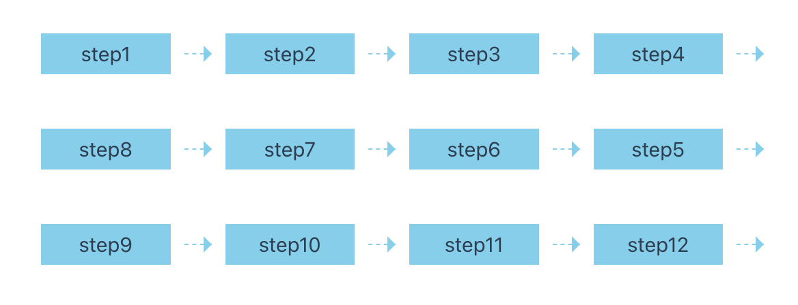

### 隐藏行末的箭头

这里需要注意一下，因为偶数行顺序被我们改变了，所以行末的应该是 4，5，12，而不是 4，8，12，即选择器应该为`#{2 * $colNum}n + #{$colNum}`和`#{2 * $colNum}n + #{$colNum + 1}`，而不是`#{$colNum}n`。

```scss
.item {
  &:nth-child(#{2 * $colNum}n + #{$colNum}),
  &:nth-child(#{2 * $colNum}n + #{$colNum + 1}) {
    &::before,
    &::after {
      display: none;
    }
  }
}
```

效果如下：

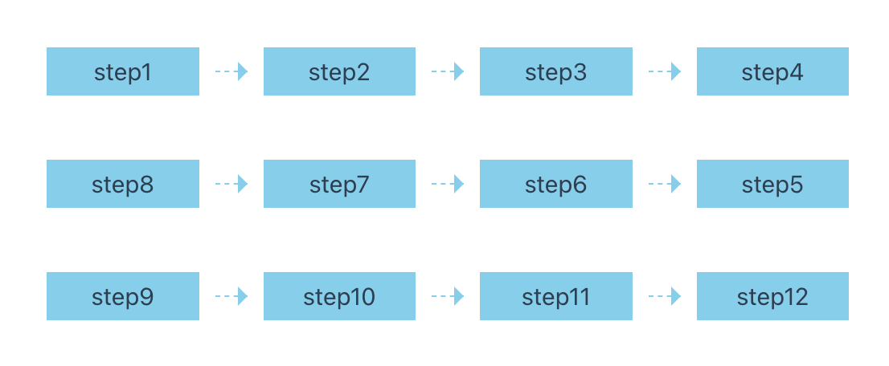

### 偶数行箭头反向

我们只需要讲箭头旋转 180 度，然后向左移动 lineWidth 的长度减去自身一半的长度即可。

```scss {5-8}
.item {
  @for $i from 1 through $colNum {
    &:nth-child(#{2 * $colNum}n + #{$colNum + $i}) {
      order: calc(var(--index) + $colNum - 2 * $i + 1);
      &::after {
        transform: translateX(calc(50% - $lineWidth))
          rotate(180deg); // 旋转箭头
      }
    }
  }
}
```

效果如下：

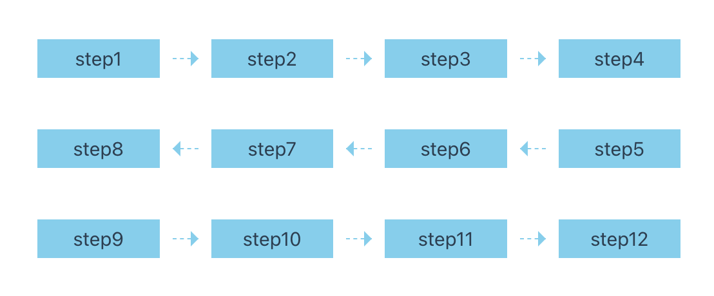

### 添加向下的箭头

每一行的末尾应该添加一个向下的箭头，这里的行末指的是 4，8，12。但是有的 before 和 after 已经被使用，比如 step8 的 before 和 after 已经被用于 7 到 8 之间的箭头，所以需要在 item 里面再套一层 div。

```vue {9}
<template>
  <div class="container">
    <div
      class="item"
      v-for="(item, index) in list"
      :key="index"
      :style="{ '--index': index + 1 }"
    >
      <div class="content">step{{ index + 1 }}</div>
    </div>
  </div>
</template>
```

然后添加相对定位(不加也行)。

```scss
.item {
  .content {
    position: relative;
    width: 100%;
    height: 100%;
    display: flex;
    align-items: center;
    justify-content: center;
  }
}
```

最后使用 content 的伪元素添加箭头。

```scss
.item {
  // 行末(4,8,12),除最后一个元素外，添加向下的连线和箭头
  &:nth-child(#{$colNum}n) {
    &:not(:last-child) {
      .content {
        // 步骤间连线
        &::before {
          content: "";
          position: absolute;
          left: 50%;
          bottom: -$rowDistance + calc(($rowDistance - $lineWidth) / 2);
          height: $lineWidth;
          border-left: 1px dashed skyblue;
        }

        // 箭头
        &::after {
          content: "";
          position: absolute;
          left: 50%;
          bottom: -$rowDistance + calc(($rowDistance - $lineWidth) / 2);
          transform: translate(-50%, 50%);
          border: 6px solid transparent;
          border-top: 6px solid skyblue;
        }
      }
    }
  }
}
```

最终效果如图所示


### 隐藏最后一个元素的箭头

看着效果是实现了，但是当我们将 colNum 设置为 5 时，发现最后一个元素的箭头没有被隐藏。

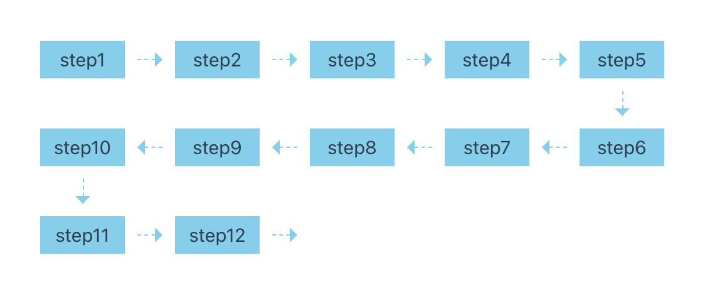

心想着无非是隐藏最后一个元素的箭头，于是便有了下面这段代码

```scss
.item {
  &:last-child {
    &::before,
    &::after {
      display: none;
    }
  }
}
```

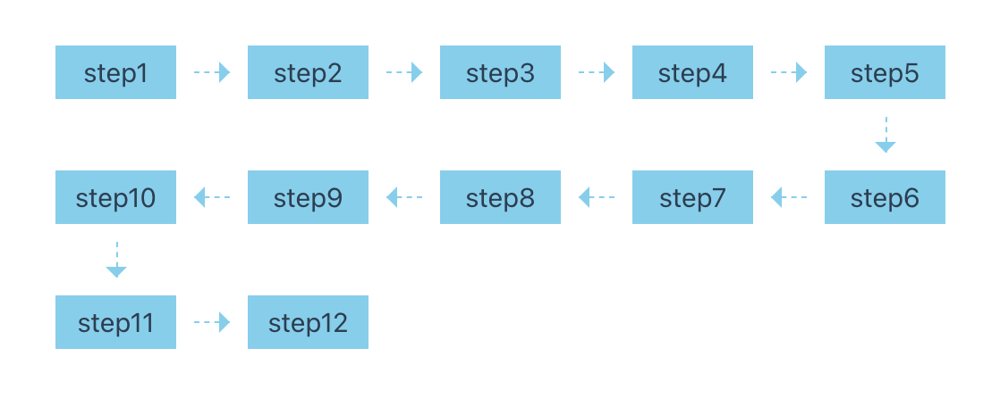

12 后面的箭头消失了，这不小菜一碟。但是当我将元素个数设置为 9 时，又双叒叕出问题了，89 之间箭头被刚刚的代码给隐藏了，同时还出现了新的 bug，6789 的位置出现了偏移。

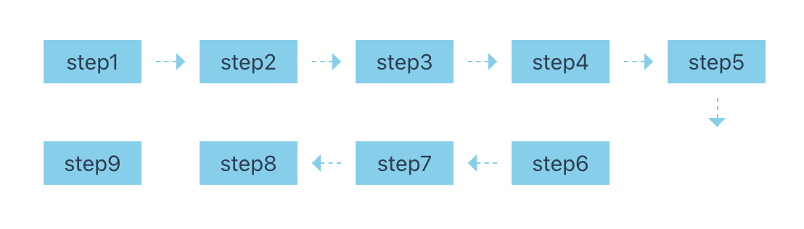

先解决箭头被隐藏的问题，发现当最后一个元素出现在偶数行时不用再去隐藏箭头，因为偶数行的顺序是反的，实际上最后一个元素应该是最右边的那一个，我们在[隐藏行末的箭头](#隐藏行末的箭头)中已经隐藏了，所以我们只需处理最后一个元素在奇数行的情况。

要判断最后一个元素是奇数行还是偶数行，我们可以根据 index 来进行判断。

```scss
// 最后一个元素出现在奇数行时，隐藏箭头
&:last-child {
  $modNum: calc(var(--index) % (2 * $colNum));
  @if $modNum > $colNum {
    &::before,
    &::after {
      display: none;
    }
  }
}
```

想法很美好，但是他报错啦！！！

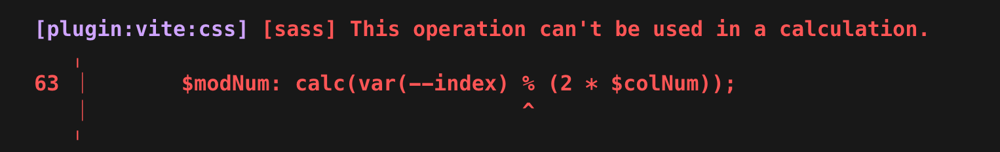

于是我删掉了 calc，`$modNum: var(--index) % (2 * $colNum);`，一保存它又报错啦！！！

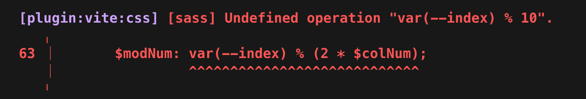

SCSS 是一个 CSS 预处理器，最终会被编译成 CSS，SCSS 在编译时并不知道 CSS 变量的值，**当表达式中使用 CSS 变量进行原生 CSS 不支持的运算时就会出错**。

> 在高版本的 Firefox 和 Safari 中已经支持了[mod 运算](https://developer.mozilla.org/en-US/docs/Web/CSS/mod)

所以说还是 JS 大法好，直接通过 JS 判断添加类名来隐藏箭头。

```vue {8,19}
<template>
  <div class="container">
    <div
      class="item"
      v-for="(item, index) in list"
      :key="index"
      :style="{ '--index': index + 1 }"
      :class="(index + 1) % (colNum * 2) > colNum ? '' : 'odd-row'"
    >
      <div class="content">step{{ index + 1 }}</div>
    </div>
  </div>
</template>

<script setup lang="ts">
import { ref } from "vue";

const list = ref(new Array(9).fill(""));
const colNum = ref(5);
</script>
```

然后添加样式，最后一个元素出现在奇数行时隐藏箭头

```scss
.item {
  // 最后一个元素出现在奇数行时，隐藏箭头
  &:last-child.odd-row {
    &::before,
    &::after {
      display: none;
    }
  }
}
```

效果如下：

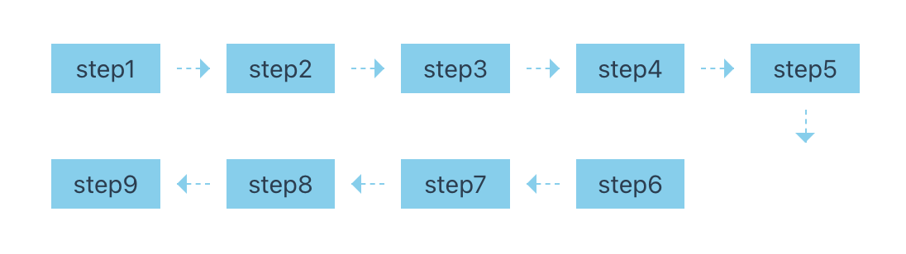

### 偶数行结尾位置偏移问题

这个问题比较好解决，我们只需要通过修改 flex 的 justify-content 属性即可，当偶数行结尾时设置为 flex-end，判断是否是偶数行结尾时需要取模运算，所以还是使用 JS 来判断。

```vue {4-7}
<template>
  <div
    class="container"
    :style="{
      'justify-content':
        list.length % (2 * colNum) > colNum ? 'flex-end' : 'flex-start',
    }"
  >
    <div
      class="item"
      v-for="(item, index) in list"
      :key="index"
      :style="{ '--index': index + 1 }"
      :class="(index + 1) % (colNum * 2) > colNum ? '' : 'odd-row'"
    >
      <div class="content">step{{ index + 1 }}</div>
    </div>
  </div>
</template>
```

效果如下：

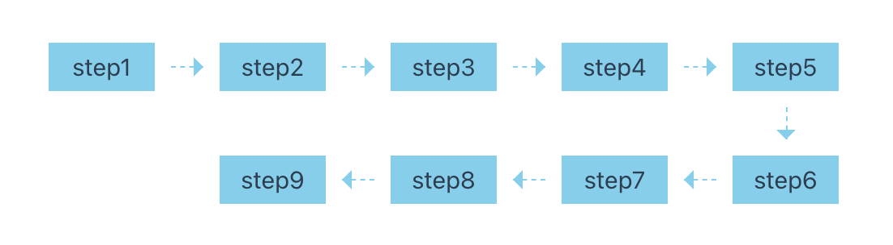

## 总结

- 一开始我是准备全用css来实现的，但是后面出现一些bug还是不得不用js，如果一开始就考虑使用js，应该更容易实现
- 缺点
  - colNum在css和js中都有，在使用的时候需要注意保持一致
  - scss变量无法使用媒体查询，如果想要响应式布局，还需要js重写代码

## 参考文章

- [CSS 如何使用flex实现灵活的“蛇形布局”](https://www.devbbq.cn/blog/details/1692001109139)
- [纯CSS实现蛇形流程图/步骤条](https://juejin.cn/post/7234061982579572793)

## 源码

```vue
<template>
  <div
    class="container"
    :style="{
      'justify-content':
        list.length % (2 * colNum) > colNum ? 'flex-end' : 'flex-start',
    }"
  >
    <div
      class="item"
      v-for="(item, index) in list"
      :key="index"
      :style="{ '--index': index + 1 }"
      :class="(index + 1) % (colNum * 2) > colNum ? '' : 'odd-row'"
    >
      <div class="content">step{{ index + 1 }}</div>
    </div>
  </div>
</template>

<script setup lang="ts">
import { ref } from "vue";

const list = ref(new Array(9).fill(""));
const colNum = ref(5);
</script>

<style lang="scss" scoped>
$colNum: 5; // 列数
$rowDistance: 40px; // 行间距
$colDistance: 40px; // 列间距
$lineWidth: 20px; // 步骤间连线长度

.container {
  display: flex;
  flex-wrap: wrap;
  gap: $rowDistance $colDistance;

  .item {
    width: calc((100% - $colDistance * ($colNum - 1)) / $colNum);
    height: 30px;
    display: flex;
    align-items: center;
    justify-content: center;
    background-color: skyblue;
    order: var(--index);
    position: relative;

    @for $i from 1 through $colNum {
      &:nth-child(#{2 * $colNum}n + #{$colNum + $i}) {
        order: calc(var(--index) + $colNum - 2 * $i + 1);
        // 偶数行箭头反向
        &::after {
          transform: translateX(calc(50% - $lineWidth))
            rotate(180deg); // 旋转箭头
        }
      }
    }

    // 步骤间连线
    &::before {
      content: "";
      position: absolute;
      right: -$colDistance + calc(($colDistance - $lineWidth) / 2);
      width: $lineWidth;
      height: 0;
      border-top: 1px dashed skyblue;
    }

    // 箭头
    &::after {
      content: "";
      position: absolute;
      right: -$colDistance + calc(($colDistance - $lineWidth) / 2);
      transform: translateX(50%);
      border: 6px solid transparent;
      border-left: 6px solid skyblue;
    }

    // 隐藏行末的连线和箭头，4，5，12，13
    &:nth-child(#{2 * $colNum}n + #{$colNum}),
    &:nth-child(#{2 * $colNum}n + #{$colNum + 1}) {
      &::before,
      &::after {
        display: none;
      }
    }

    // 最后一个元素出现在奇数行时，隐藏箭头
    &:last-child.odd-row {
      &::before,
      &::after {
        display: none;
      }
    }

    .content {
      position: relative;
      width: 100%;
      height: 100%;
      display: flex;
      align-items: center;
      justify-content: center;
    }

    // 行末(4,8,12),除最后一个元素外，添加向下的连线和箭头
    &:nth-child(#{$colNum}n) {
      &:not(:last-child) {
        .content {
          // 步骤间连线
          &::before {
            content: "";
            position: absolute;
            left: 50%;
            bottom: -$rowDistance + calc(($rowDistance - $lineWidth) / 2);
            height: $lineWidth;
            border-left: 1px dashed skyblue;
          }

          // 箭头
          &::after {
            content: "";
            position: absolute;
            left: 50%;
            bottom: -$rowDistance + calc(($rowDistance - $lineWidth) / 2);
            transform: translate(-50%, 50%);
            border: 6px solid transparent;
            border-top: 6px solid skyblue;
          }
        }
      }
    }
  }
}
</style>
```
